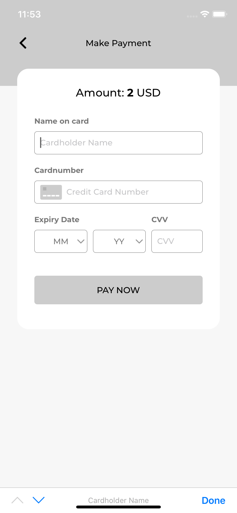

[](https://pub.dev/packages/flutter_paytabs_bridge_emulator)

## Flutter PayTabs Bridge Emulator

Flutter PayTabs Bridge Emulator is a wrapper for the native PayTabs Android and iOS SDKs, It helps you integrate with PayTabs payment gateway.

Flutter support:
* [x] iOS
* [x] Android

## Usage

# Installation
Add `flutter_paytabs_bridge_emulator` to your package's `pubspec.yaml` file:

```yaml
dependencies:
  flutter_paytabs_bridge_emulator: ^1.0.1-beta
```

# Pay now

Import flutter_paytabs_bridge_emulator
```dart
import 'package:flutter_paytabs_bridge_emulator/flutter_paytabs_bridge_emulator.dart';
```

## Pay with PayTabs
1. Configure arguments

```dart
var args = {
      pt_merchant_email: "test@example.com",
      pt_secret_key: "BIueZNfPLblJnMmPYARDEoP5x1WqseI3XciX0yNLJ8v7URXTrOw6dmbKn8bQnTUk6ch6L5SudnC8fz2HozNBVZmh7w9uq4Pwg7D1",// Add your Secret Key Here
      pt_transaction_title: "Mr. John Doe",
      pt_amount: "2.0",
      pt_currency_code: "USD",
      pt_customer_email: "test@example.com",
      pt_customer_phone_number: "+97333109781",
      pt_order_id: "1234567",
      product_name: "Tomato",
      pt_timeout_in_seconds: "300", //Optional
      pt_address_billing: "test test",
      pt_city_billing: "Juffair",
      pt_state_billing: "state",
      pt_country_billing: "BHR",
      pt_postal_code_billing: "00973", //Put Country Phone code if Postal code not available '00973'//
      pt_address_shipping: "test test",
      pt_city_shipping: "Juffair",
      pt_state_shipping: "state",
      pt_country_shipping: "BHR",
      pt_postal_code_shipping: "00973", //Put Country Phone code if Postal
      pt_color: "#cccccc",
      pt_language: 'en', // 'en', 'ar'
      pt_tokenization: true,
      pt_preauth: false
    };
```

2. Start calling `startPayment` method and handle the transaction details

```dart
FlutterPaytabsSdk.startPayment(args, (event) {
    List<dynamic> eventList = event;
    Map firstEvent = eventList.first;
    if(firstEvent.keys.first == "EventPreparePaypage") {
        // TODO
        // Here you can handle prepare events
    } else {
        // TODO
        // Here you can handle transcation details
    }
    });
```

# Pay with Apple Pay

1. Configure arguments

```dart
var args = {
  pt_merchant_email: "test@example.com",
  pt_secret_key: "kuTEjyEMhpVSWTwXBSOSeiiDAeMCOdyeuFZKiXAlhzjSKqswUWAgbCaYFivjvYzCWaWJbRszhjZuEQqsUycVzLSyMIaZmhLlRqlp",// Add your Secret Key Here
  pt_transaction_title: "Mr. John Doe",
  pt_amount: "2.0",
  pt_currency_code: "AED",
  pt_customer_email: "test@example.com",
  pt_order_id: "1234567",
  pt_country_code: "AE",
  pt_language: 'en',
  pt_preauth: false,
  pt_merchant_identifier: 'merchant.bundleId'
  pt_tokenization: true,
};
```

2. Start calling `startApplePayPayment` method and handle the transaction details

```dart
FlutterPaytabsSdk.startApplePayPayment(args, (event) {
    List<dynamic> eventList = event;
    Map firstEvent = eventList.first;
    if(firstEvent.keys.first == "EventPreparePaypage") {
        // TODO
        // Here you can handle prepare events
    } else {
        // TODO
        // Here you can handle transcation details
    }
    });
```
# Prerequisites (iOS) 
Disable the perfect forward secrecy (PFS) only for paytabs.com

```xml
<key>NSAppTransportSecurity</key>
<dict
    <key>NSExceptionDomains</key>
    <dict>
        <key>paytabs.com</key>
        <dict>
            <key>NSIncludesSubdomains</key>
            <true/>
            <key>NSThirdPartyExceptionRequiresForwardSecrecy</key>
            <false/>
        </dict>
    </dict>
</dict>
```

## Demo application

Check our complete [example][example].



## License

See [LICENSE][license].

## Paytabs

[Support][1] | [Terms of Use][2] | [Privacy Policy][3]

 [1]: https://www.paytabs.com/en/support/
 [2]: https://www.paytabs.com/en/terms-of-use/
 [3]: https://www.paytabs.com/en/privacy-policy/
 [license]: https://github.com/paytabscom/flutter_paytabs_bridge/master/LICENSE
 [example]: https://github.com/paytabscom/flutter_paytabs_bridge/tree/master/example